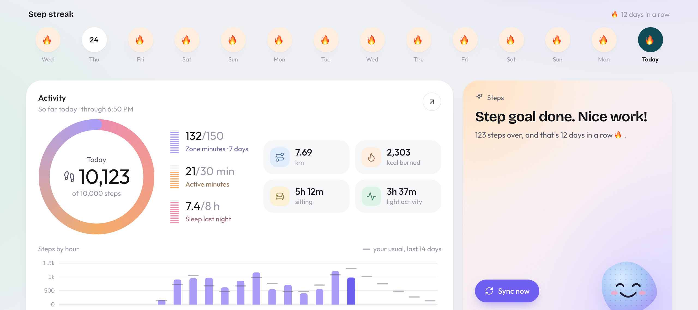
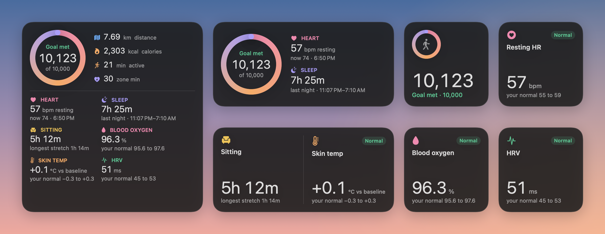

<h1 align="center">Fitbit Air Dashboard</h1>

<p align="center">
  Your Fitbit Air's steps, heart rate, sleep and recovery in one calm page, plus native macOS desktop widgets.<br>
  Runs on your own computer. Read-only. No packages to install.
</p>

<p align="center">
  <picture>
    <source media="(prefers-color-scheme: dark)" srcset="docs/dashboard-dark.png">
    
  </picture>
</p>

<p align="center"><sub>Screenshots use made-up demo data (<code>demo.py</code>).</sub></p>

## Features

- **Today at a glance**: steps ring toward your goal, active and zone minutes, distance, calories, time sitting
- **Step streak**: the last 14 days, a 🔥 for every day you hit your goal; click a day to open it
- **Heart rate** in 5-minute averages, **last night's sleep** with stages, and **trends** over 7 / 30 / 90 days
- **Recovery**: resting heart rate, HRV, breathing, blood oxygen and skin temperature, each marked
  Normal / High / Low against *your own* 30-day normal
- **One-line suggestion**: ahead of your usual pace, goal reached, or "take it easy today"
- **Desktop widgets** for macOS that sit next to Apple's own
- **Private**: everything stays in a local SQLite file; Google is only ever read, never written

## Quick start

```bash
python3 server.py
```

It opens http://127.0.0.1:8787. The first time, it asks you to sign in with Google ([one-time setup](#google-setup)).

**No Fitbit? Try it with demo data:**

```bash
python3 demo.py
DASH_DATA=demo-data DASH_NO_SYNC=1 python3 server.py
```

## Desktop widgets

<p align="center">
  
</p>

Three widgets in Apple's small, medium and large sizes: **Steps**, **Stat** (pick any of 13 stats, like blood oxygen
or time sitting) and **Overview**. Right-click a widget → **Edit Widget** to choose what it shows.

```bash
sh macwidget/install.sh
```

Then right-click the desktop → **Edit Widgets…** → search **Fitbit Air**. Needs Xcode, but no Apple developer account.
More in [macwidget/README.md](macwidget/README.md).

## Google setup

You do this once, in the [Google Cloud console](https://console.cloud.google.com/):

1. Create a project and enable the **Google Health API**.
2. Set up the OAuth consent screen as **External** in **Testing** mode, with yourself as the only test user.
3. Create an OAuth client of type **Desktop app** and save its JSON as `data/client_secret.json`.
4. Run `python3 server.py` and approve the read-only access.

> [!NOTE]
> Google expires logins for Testing-mode apps after **7 days**. The dashboard shows how many days are left and a
> **Reconnect Google** button when it's time. Nothing stored locally is lost, and it backfills the gap.

<details>
<summary>Scopes it asks for (all read-only)</summary>

`googlehealth.activity_and_fitness.readonly`, `googlehealth.health_metrics_and_measurements.readonly`,
`googlehealth.sleep.readonly`, `googlehealth.profile.readonly`, `googlehealth.settings.readonly`

Already set up the official `ghealth` CLI? The dashboard reuses that login on first start.
</details>

## How it works

The Air syncs to your phone, and the phone uploads to Google about every 15 minutes. The dashboard checks every
couple of minutes whether there's anything new, and if so pulls the last few days again (Google fills in overnight
metrics after you wake up). After an outage or an expired login, the next pull covers the whole gap. **Sync now**
forces a pull; the header always shows when your Air last synced.

Days without data show as gaps, never as zeros, and don't count toward averages.

<details>
<summary>Files and settings</summary>

```
server.py      web server, JSON API, background sync
sync.py        Google Health API → SQLite
healthapi.py   Google sign-in (desktop loopback + PKCE) and API client
store.py       the SQLite database
web/           the page (plain HTML, CSS and SVG charts)
macwidget/     the macOS widgets (Xcode project)
widget/        an older Übersicht version of the widget
demo.py        made-up data for trying it out
data/          your data: history, Google login, goals (private, never committed)
```

| Setting | Default | |
|---|---|---|
| `DASH_PORT` | `8787` | Port for the page |
| `DASH_DATA` | `data` | Where your history and login live |
| `DASH_NO_SYNC=1` | off | Show stored data without calling Google |

Goals and your name live in `data/goals.json`:
`{"name": "", "steps": 10000, "sleep_hours": 8, "azm_week": 150, "active_minutes": 30}`.

The server only listens on `127.0.0.1`. The widgets read a trimmed summary from `/api/widget`, protected by a
key in `data/widget_secret`.
</details>
